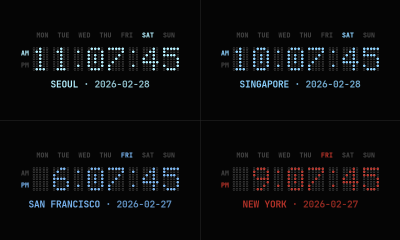
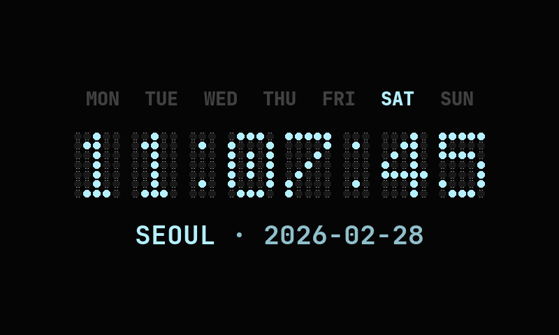
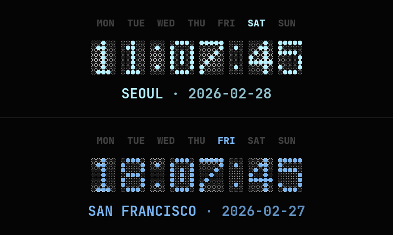
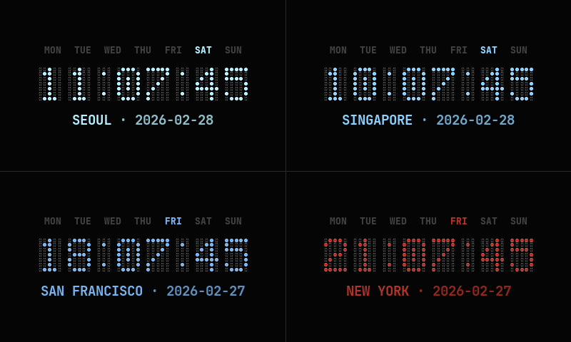
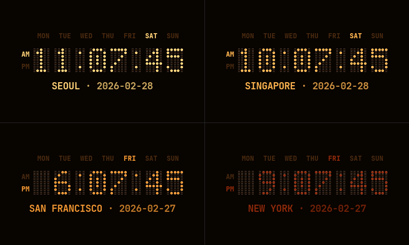
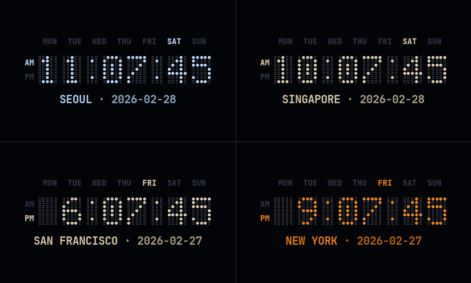
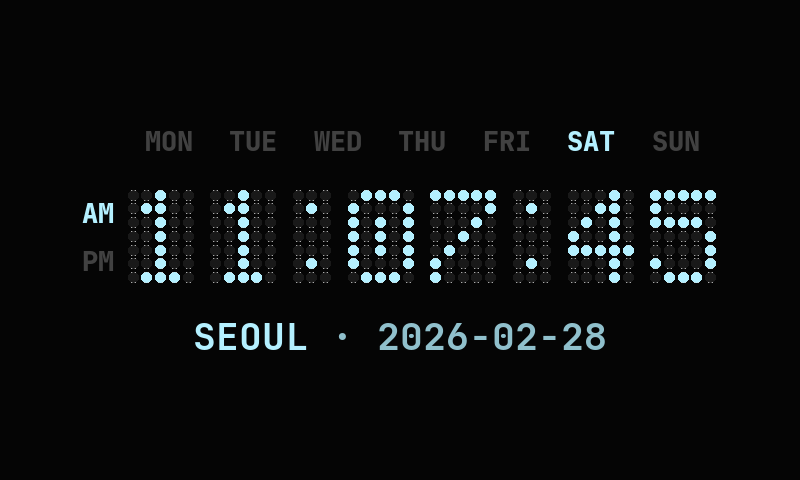
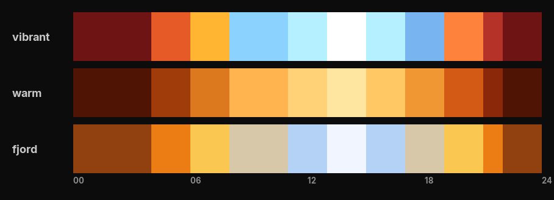

# mclocks — for Raspberry Pi

> A pygame-based multi-timezone world clock for always-on Raspberry Pi displays — 2-pane or 2×2 layout, LED dot-matrix digits, and time-of-day circadian colors.



---

## Features

- 🕐 LED dot-matrix clock rendered with pygame — no desktop required
- 🌍 Single, 2-pane (top/bottom), or 2×2 layout
- 🎨 Circadian color — each clock shifts color by its own local time of day
- 🎭 Themes — `vibrant` (default), `warm`, and `fjord`, switchable at runtime
- ⚙️ Config file for timezones and default theme
- 🖥️ Designed for always-on Raspberry Pi displays (800×480)

---

## Requirements

- Raspberry Pi OS Bookworm Lite
- Python 3.11 or later — `sudo apt install python3`
- pygame — `sudo apt install python3-pygame`
- pytz — `sudo apt install python3-tz`
- RPi 2 only: X11 — `sudo apt install xserver-xorg xinit x11-xserver-utils`

See [SETUP.md](SETUP.md) for recommended OS by model, display driver details, and macOS development setup.

---

## Installation

```bash
curl -fsSL https://raw.githubusercontent.com/yusungchang/mclocks/main/install.sh | sudo bash
```

You can inspect [`install.sh`](install.sh) before running.

Installs:
- `/usr/local/bin/mclocks` — launcher
- `/usr/local/lib/mclocks/mclocks.py` — main script
- `/usr/local/lib/mclocks/mclocks.conf` — configuration
- `/usr/local/lib/mclocks/fonts/` — clock fonts (JetBrains Mono)

---

## Usage

```
mclocks [MODE] [THEME] [OPTIONS]
```

### Arguments
| Argument | Values | Default |
|----------|--------|---------|
| `MODE` | `1` (single), `2` (top/bottom), `4` (2×2 grid) | `4` |
| `THEME` | `vibrant`, `warm`, `fjord` | `vibrant` |

```bash
mclocks          # 2×2 layout, vibrant theme
mclocks 1        # single clock, full screen
mclocks 2        # top/bottom layout, vibrant theme
mclocks 4 warm   # 2×2 layout, warm theme
mclocks 1 fjord  # single clock, fjord theme
```

### Options

| Flag | Description |
|------|-------------|
| `--12h` | 12-hour format with AM/PM indicator |
| `--24h` | 24-hour format (default) |
| `-h`, `--help` | Display help and exit |
| `-v`, `--version` | Display version and exit |

## Examples

| Single (`mclocks 1`) | 2-pane (`mclocks 2`) | 4-pane (`mclocks 4`) |
|----------------------|----------------------|----------------------|
|  |  |  |

| Vibrant (`mclocks vivrant`) | Warm (`mclocks warm`) | Fjord (`mclocks fjord`) |
|----------------------|----------------------|----------------------|
|  |  |  |

| 12-hour (`mclocks --12h`) | 24-hour (`mclocks --24h`) |
|----------------------|----------------------|
|  |  |

---

## Configuration

Edit `/usr/local/lib/mclocks/mclocks.conf` to set your timezones and default theme:

```ini
[settings]
default_theme = vibrant

[locations]
location1 = LOCAL, local
location2 = SAN FRANCISCO, America/Los_Angeles
location3 = SINGAPORE, Asia/Singapore
location4 = NEW YORK, America/New_York
```

Use `local` as the timezone value to auto-detect from the system. See the [tz database](https://en.wikipedia.org/wiki/List_of_tz_database_time_zones) for timezone strings.

Display order:

| Mode | Position |
|------|----------|
| `mclocks 1` | 1=middle |
| `mclocks 2` | 1=top, 2=bottom |
| `mclocks 4` | 1=top-left, 2=bottom-left, 3=top-right, 4=bottom-right |

---

## Themes & Circadian Colors

Each theme defines a circadian color schedule — the clock digits shift color based on each pane's own local time of day. Two clocks in different timezones can show different colors at the same moment.

| Theme | Style |
|-------|-------|
| `vibrant` | Full spectrum — dark red at night, through cyan midday, to white peak |
| `warm` | Amber and red tones throughout the day |
| `fjord` | Nordic panorama — warm amber at dawn/dusk, cool blue-white at peak |



---

## Setup Guide

See [SETUP.md](SETUP.md) for instructions on platform-specific setup.

---

## License

MIT © 2026 Yu-Sung Chang — see [LICENSE](LICENSE) for terms.